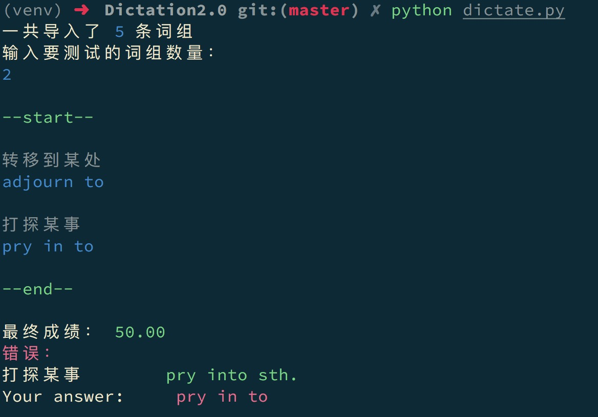

### Dictation2.0

Based on [Dictation](<http://pluckytyx.top/2017/10/%E6%9B%B4%E6%96%B0%E8%AF%8D%E7%BB%84%E9%BB%98%E5%86%99%E5%B7%A5%E5%85%B7>), a tool to help you accumulate foreign language phrases, a built-in scoring system that allows you to dictate phrases, score and record your grades, and intelligently filter phrases that you need to remember.

#### New Features

- Support for adding multiple phrase files.
- Record your dictation history scores.
- Intelligence optimizes the phrases you need to remember.

#### Environment

```
python3
```

#### How to use

- Download the source and open the command line in the directory to run:

  ```
  python dictate.py
  ```

- pip

  ```
  Not yet released
  ```

#### Configuration item

The file config specifies the path and name of the loaded phrase file. Multiple files separated by spaces.

#### Add phrases

You can add phrases to your phrase file in the following format:

```
foreign language phrase -Translation phrase
```

The foreign language phrase and translation phrase were seperated by " -"(space and '-').

#### Demo

 